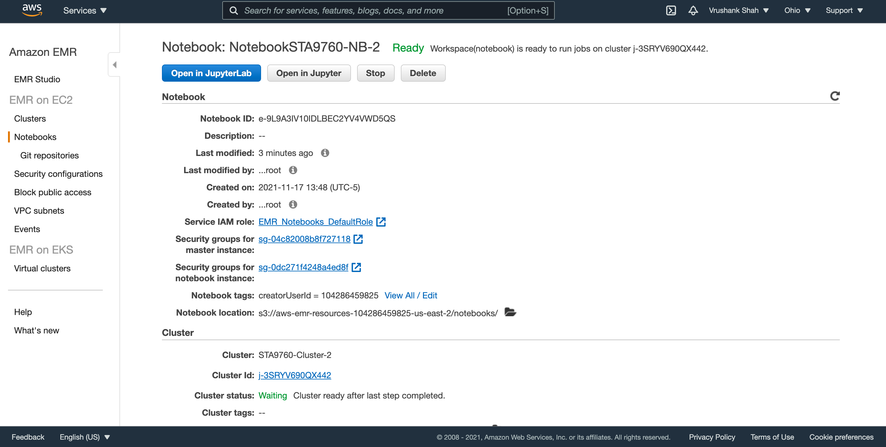
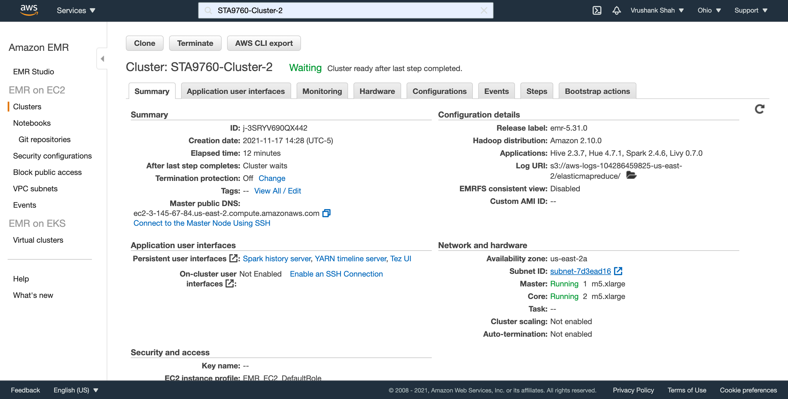

# Analyzing 10Gb of Yelp Reviews Data
### Vrushank Shah

## 1. Introduction
For this project, I provisioned a Spark Cluster on AWS EMR for loading data and ran some analysis on Yelp’s Reviews, Businesses and Users dataset (about 10gb) from **[Kaggle](https://www.kaggle.com/yelp-dataset/yelp-dataset)**.  

### Software Used
In order to analyze this data, I launched an Apache Spark cluster via AWS. I leveraged the power of this cluster inside of a jupyter notebook, using Pyspark. The notebook, ("Analysis.ipynb"), contains all of the necessary code to run this script. Several python modules were needed to run this analysis, and were installed at the beginning of the notebook (Matplotlib, Pandas, Seaborn).

*Here are steps:*

- Go to S3 on AWS and Create a bucket with a name yelp
- Create a folder called "yelp/" then download 3 Yelp datasets from Kaggle (files ending "_user.json", "_review.json", "_business.json") 
- Upload these datasets to the S3 bucket 
- Open the notebook in Jupyter Lab 
- Follow the code in Analysis.ipynb
- Make sure to terminate the cluster after being done with the analysis to avoid excessive cost
- Stop the notebook as well

## Cluster and Notebook Configs

